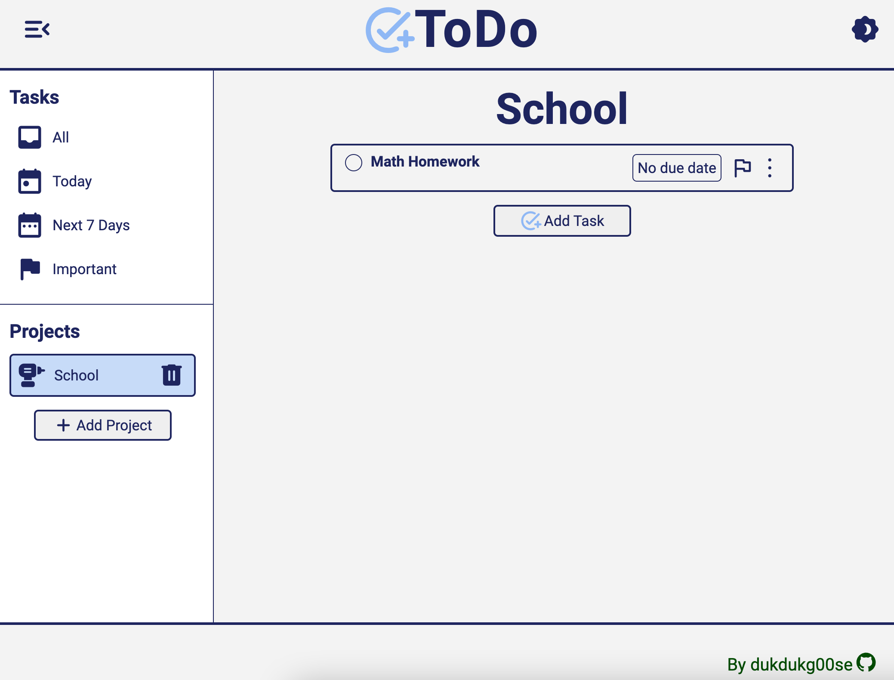

# ToDo list: Produtivity App

## Overview

A Todo List web application to help with productivity and mental stability.

## Usage

- Create new projects and add tasks to organize your daily priorities
- Flag important tasks and add a due date to quickly view upcoming or urgent priorities in the quick view panel
- Mark tasks complete to blur out tasks
- Delete projects and tasks by clicking the trash icon
- To minimize menu select the Collapse Menu icon in the top left corner
- To toggle between light and dark mode select theme toggler in the top right corner

[Live Demo](https://dukdukg00se.github.io/todo-list/)

## Learning Objectives

Educational goals when building this application:

- Consider code organization and SOLID principles
- Practice working with webpack
- Practice working with Babel
